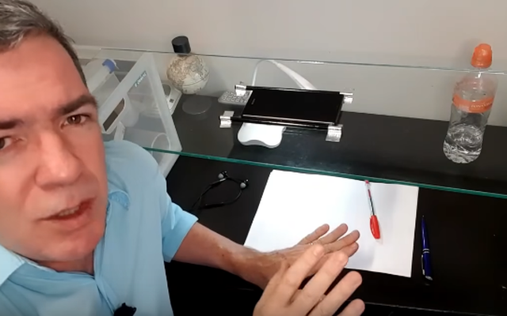
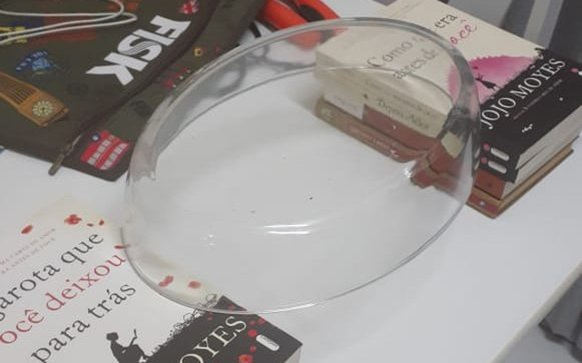
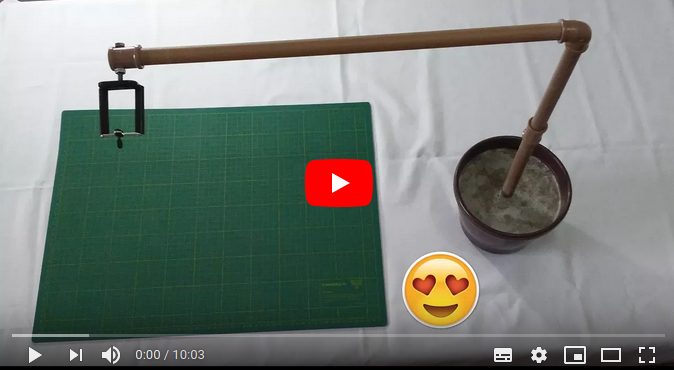
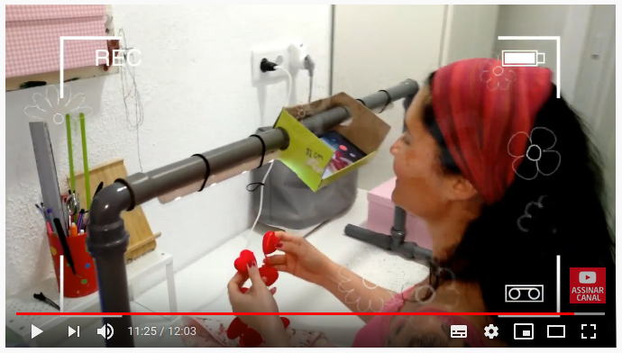
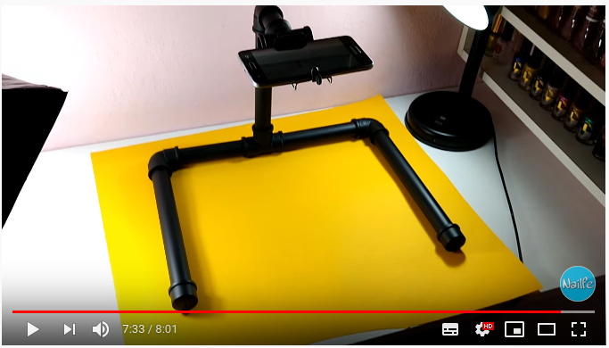
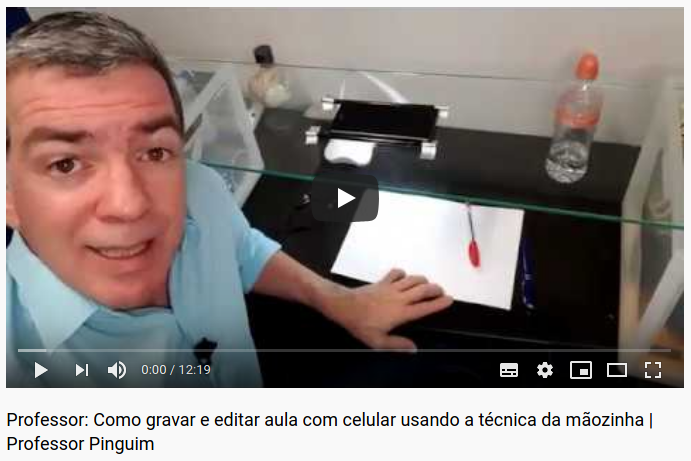
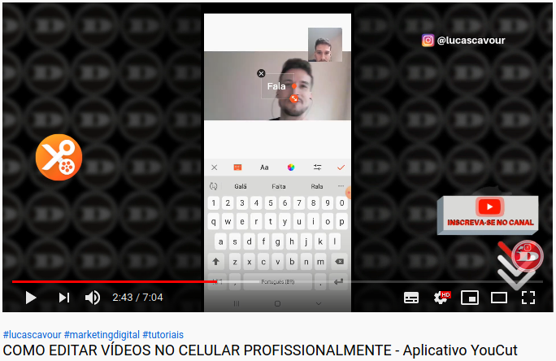
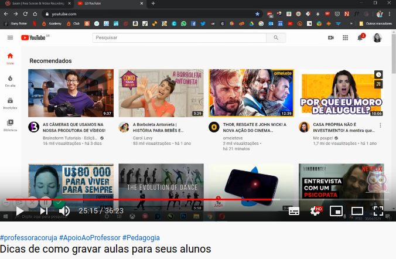

# Criação de Conteúdo

## Motivação
- O objetivo desse módulo é alcançar o máximo de professores possível e permitir o fluxo básico de trabalho.
- Buscando o máximo de acessibilidade, faremos todas as atividades usando apenas ferramentas do celular. Em **nenhuma** das etapas a seguir será necessário o uso do computador.
- Pensamos nos fluxos de trabalho e necessidades mais comuns. Aqueles que a maioria das pessoas vai utilizar na maior parte do tempo e que atenda todas as suas necessidades básicas.
- Ao final do módulo você será capaz de **gravar**, **editar** e **publicar** seu material com o mínimo de esforço possível para que você possa se concentrar no que realmente importa: sua metodologia e didática e o acompanhamento do progresso dos seus alunos. 

## Conteúdo

<!--TOC_BEGIN-->
- [Motivação](#motivação)
- [Conteúdo](#conteúdo)
- [Gravação](#gravação)
    - [Usando material físico](#usando-material-físico)
        - [Preparação](#preparação)
            - [Suporte vertical utilizando algo da sua casa](#suporte-vertical-utilizando-algo-da-sua-casa)
            - [Construindo ou adaptando um suporte vertical](#construindo-ou-adaptando-um-suporte-vertical)
        - [Gravando](#gravando)
        - [**Open Camera**](#open-camera)
    - [Usando material digital](#usando-material-digital)
        - [Preparação](#preparação)
        - [Gravação](#gravação)
    - [Dicas importantes](#dicas-importantes)
- [Editando seu vídeo](#editando-seu-vídeo)
- [Publicando seu vídeo](#publicando-seu-vídeo)

<!--TOC_END-->

___
- [Gravação](#Gravação):
    - [Usando material físico](#Usando-material-f%C3%ADsico)
        - Papel, Livro, Apostila, lápis, caneta, ...
    - [Usando material digital](#Usando-material-digital)
        - Arquivo em pdf, doc, slide ou direto do navegador.
- Edição básica
    - Recortar trechos indesejados: início, meio ou fim.
    - Recortar as bordas: operação de crop.
    - Juntar ou separar vídeos.
- Publicação
    - Youtube
    - Google Drive
    - Whatsapp

## Gravação
### Usando material físico

Você vai utilizar esse modelo se quiser trabalhar com o livro, apostila, papel e caneta ou qualquer material físico. Esse é o modelo mais simples de trabalho e permite que você utilize o material didático que já possui. 

A única coisa que vai precisar é criar ou improvisar um suporte de mesa para o celular. Vamos lhe dar alguns modelos aqui.

#### Preparação
- Software a instalar:
    - O próprio software da câmera do seu celular.
    - Opcional: **Open câmera** (permite diminuir a qualidade e consequentemente o tamanho do arquivo da gravação).

- Material a construir ou adquirir
    - Suporte para celular: vidro, pires, pvc, régua

##### Suporte vertical utilizando algo da sua casa

Usando um vidro [Link](https://www.youtube.com/watch?v=hphFQzHCYgE)| Usando uma travessa de vidro
-------|-------
|

##### Construindo ou adaptando um suporte vertical

[Link](https://www.youtube.com/watch?v=4NGu1tOZGDY)|[Link](https://www.youtube.com/watch?v=63DKPAcdVOM)|[Link](https://www.youtube.com/watch?v=NOVrlLInRb8)|-
-------|------|-|-
||

___
#### Gravação

#### **Open Camera**
    - Em construção

### Usando material digital

- Se você já tem um arquivo digital como um pdf, um documento de texto, um slide pronto ou outra midia que construiu ou baixou da internet, você pode utilizar a gravar a tela do seu celular enquanto manipula esse documento.
- Dessa forma tudo que estiver vendo no seu celular será gravado, juntamente com sua voz e, se quiser, sua câmera frontal.
- O primeiro passo é baixar ou deixar disponíveis os links, fotos ou material que você deseja utilizar no seu celular.

#### Preparação

- Instale algum gravador de tela: Sugestão: **Xrecorder** da Empresa **Inshot**
    - Funcionalidades: Captura de tela, áudio, câmera com possibilidade de desenhar na tela.
    - **TUTORIAL DE INSTALAÇÂO**: Em construção
    - Habilite a bolinha flutuante pra facilitar a navegação no aplicativo

#### Gravação
    - Abra o seu arquivo, slide ou pdf.
    - Inicie a gravação.
    - Vá explicando e passando o material.
    - Finalize a gravação.

### Dicas importantes
- Faça um roteiro e deixe visível pra você poder ter uma referência
- Coloque o celular em modo avião pra evitar ser atrapalhado com notificações ou ligações.
- Grave sempre com o celular deitado.
- Use a câmera traseira que normalmente é melhor que a câmera frontal
- Use o fone de ouvido do seu celular, capta melhor que o seu celular.
- Faça vídeos curtinhos e objetivos, tente ficar abaixo dos 5 minutos. 
- Melhor vários vídeos curtos que um longo.

## Editando seu vídeo
### Operações de edição básicas
- **Em construção**
### Softwares de edição
#### Vlogit

#### Youcut

## Publicando seu vídeo

- Youtube: 
    - Público ou Privado
    - Playlists

    - Vídeo enviando do aplicativo do youtube do celular **EM CONSTRUÇÃO**

- Enviando para o google drive **EM CONSTRUÇÃO**
- Enviando para o whatsapp **EM CONSTRUÇÃO**